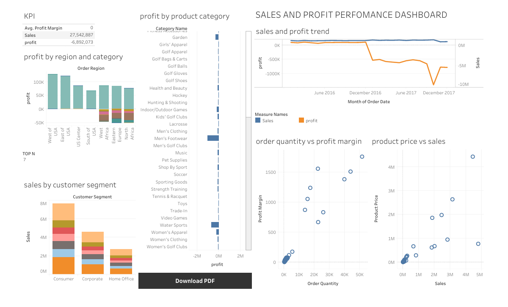

# Sales and Profit Performance Dashboard



## Overview

This professional Tableau dashboard analyzes sales and profit data to identify trends, patterns, and actionable business insights. By visualizing key performance indicators related to sales performance, profit margins, product categories, customer segments, and geographic regions, this tool empowers business decision-makers to optimize their strategies and improve overall profitability.

## Features

- **Sales Performance Analysis**: Track sales trends over time, identify top-performing products and regions
- **Profit Analysis**: Analyze profit margins across different dimensions (products, regions, customer segments)
- **Customer Segmentation**: Understand the behavior and value of different customer segments
- **Geographic Analysis**: Visualize sales and profit distribution across different markets and regions
- **Product Category Performance**: Identify the best and worst performing product categories
- **Interactive Visualizations**: Rich, interactive Tableau dashboards with drill-down capabilities
- **Export Functionality**: Export insights and reports for stakeholder presentations

## Project Structure

```
Sales-and-Profit-Performance-Dashboard/
├── data/
│   └── raw/               # Raw, immutable data
│       └── Sales dataset.csv  # Original sales data
├── visualizations/        # Tableau workbooks
│   └── sales and profit analysis.twb  # Main Tableau dashboard
├── docs/                  # Documentation files
│   └── requirements.md    # Detailed requirements documentation
├── .gitignore            # Git ignore file
└── README.md              # Project overview
```

## Getting Started

### Prerequisites

- Tableau Desktop/Public (required for viewing and interacting with .twb files)
- Tableau Reader (for users who only need to view the dashboard)

### Installation

1. Clone this repository:
   ```bash
   git clone https://github.com/yourusername/Sales-and-Profit-Performance-Dashboard.git
   cd Sales-and-Profit-Performance-Dashboard
   ```

### Usage

1. View the Tableau dashboard:
   - Open Tableau Desktop or Tableau Public
   - Open `visualizations/sales and profit analysis.twb`
   - Interact with the visualizations to explore different dimensions of the data
   
2. Export insights:
   - Use Tableau's built-in export functionality to save visualizations as images or PDFs
   - Create custom dashboard views for different stakeholder presentations

## Data Description

The dataset includes the following key fields:

- **Sales Metrics**: 
  - Order Item Total
  - Sales 
  - Profit Margin
  - Profit Per Order
- **Product Information**:
  - Category Name
  - Product Price
  - Product Cost
- **Customer Data**:
  - Customer ID
  - Customer Segment
  - Customer Location (City, State, Country)
- **Order Details**:
  - Order Date
  - Order ID
  - Order Quantity
  - Shipping Method
- **Geographic Information**:
  - Market
  - Order Region
  - Shipping Location

## Analysis Highlights

- **Time Series Analysis**: Seasonal trends in sales and profits through Tableau's time series visualizations
- **Product Category Performance**: Comparative analysis of product categories by profitability using Tableau's bar charts and tree maps
- **Geographic Sales Distribution**: Heat maps and filled maps showing regional sales concentration
- **Customer Segment Analysis**: Analysis of customer segments through Tableau's grouping and filtering capabilities
- **Correlation Analysis**: Key relationships between pricing, sales volume, and profitability using Tableau's scatter plots and dual-axis charts
- **Forecasting**: Sales trends forecasting using Tableau's built-in forecasting features

## Future Improvements

- Predictive analytics for sales forecasting using machine learning
- Customer lifetime value analysis and segmentation
- Market basket analysis for product recommendations
- Interactive web dashboard with Tableau Public or Tableau Server
- Real-time data pipeline integration
- Mobile-responsive dashboard design

## Contributing

Contributions are welcome! Please feel free to submit a Pull Request.

## License

This project is licensed  under the MIT License - see the LICENSE file for details.
